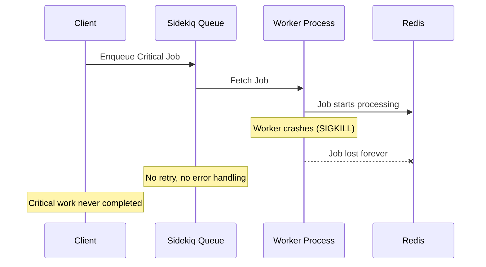
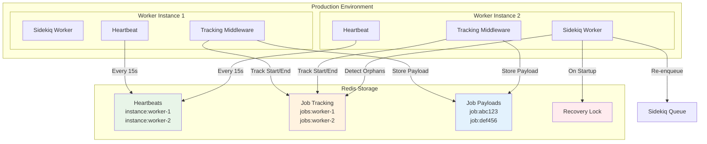

# Sidekiq Assured Jobs

Reliable job execution guarantee for Sidekiq with automatic orphan recovery.

## Overview

Sidekiq Assured Jobs ensures that your critical Sidekiq jobs are never lost due to worker crashes, pod restarts, or unexpected shutdowns. It provides a robust tracking system that monitors in-flight jobs and automatically recovers any work that was interrupted.

**Perfect for:**
- Critical business processes that cannot be lost
- Financial transactions and payment processing
- Data synchronization and ETL operations
- Email delivery and notification systems
- Any job where reliability is paramount

## Key Features

- **🛡️ Job Assurance**: Guarantees that tracked jobs will complete or be automatically retried
- **🔄 Automatic Recovery**: Detects and re-enqueues orphaned jobs from crashed workers
- **⏰ Delayed Recovery**: Configurable additional recovery passes for enhanced reliability
- **🖥️ Web Dashboard**: Monitor and manage orphaned jobs through Sidekiq's web interface
- **⚡ Zero Configuration**: Works out of the box with sensible defaults
- **🏗️ Production Ready**: Designed for high-throughput production environments
- **🔗 Sidekiq Integration**: Uses Sidekiq's existing Redis connection pool
- **🔒 Distributed Locking**: Prevents duplicate recovery operations
- **📊 Minimal Overhead**: Lightweight tracking with configurable heartbeat intervals

## The Problem

When Sidekiq workers crash or are forcefully terminated (SIGKILL), jobs that were being processed are lost forever:



## The Solution

Sidekiq Assured Jobs tracks in-flight jobs and automatically recovers them:



## Installation

Add this line to your application's Gemfile:

```ruby
gem 'sidekiq-assured-jobs'
```

And then execute:

```bash
bundle install
```

## Quick Start

### 1. Basic Setup

The gem auto-configures itself when required:

```ruby
# In your application (e.g., config/application.rb or config/initializers/sidekiq.rb)
require 'sidekiq-assured-jobs'
```

### 2. Enable Job Tracking

Include the `AssuredJobs::Worker` module in workers you want to track:

```ruby
class PaymentProcessor
  include Sidekiq::Worker
  include Sidekiq::AssuredJobs::Worker  # Enables job assurance

  def perform(payment_id, amount)
    # This job will be tracked and recovered if the worker crashes
    process_payment(payment_id, amount)
  end
end

class LogCleanupWorker
  include Sidekiq::Worker
  # No AssuredJobs::Worker - not tracked (fine for non-critical work)

  def perform
    # This job won't be tracked
    cleanup_old_logs
  end
end
```

### 3. That's It!

Your critical jobs are now protected. If a worker crashes while processing a tracked job, another worker will automatically detect and re-enqueue it.

## Web Interface

Sidekiq Assured Jobs includes a web dashboard that integrates seamlessly with Sidekiq's existing web interface. The dashboard allows you to monitor and manage orphaned jobs in real-time.

### Setup

The web interface is automatically available when you mount Sidekiq::Web in your application:

```ruby
# config/routes.rb (Rails)
require 'sidekiq/web'
mount Sidekiq::Web => '/sidekiq'
```

Or for standalone applications:

```ruby
# config.ru
require 'sidekiq/web'
run Sidekiq::Web
```

### Features

The **Orphaned Jobs** tab provides:

- **📊 Real-time Dashboard**: View all orphaned jobs with key information
- **🔍 Job Details**: Detailed view of individual orphaned jobs including arguments and error information
- **🔄 Manual Recovery**: Retry orphaned jobs individually or in bulk
- **🗑️ Job Management**: Delete orphaned jobs that are no longer needed
- **📈 Instance Monitoring**: Track the status of worker instances (alive/dead)
- **⏱️ Auto-refresh**: Dashboard automatically updates every 30 seconds
- **🎯 Bulk Operations**: Select multiple jobs for batch retry or delete operations

### Dashboard Information

For each orphaned job, the dashboard displays:

- **Job ID**: Unique identifier for the job
- **Class**: The worker class name
- **Queue**: The queue the job was running in
- **Instance**: The worker instance that was processing the job
- **Orphaned Time**: When the job became orphaned
- **Duration**: How long the job has been orphaned
- **Arguments**: The job's input parameters
- **Error Information**: Any error details if the job failed

### Actions Available

- **Retry**: Re-enqueue the job for processing
- **Delete**: Remove the job from tracking (cannot be undone)
- **Bulk Retry**: Retry multiple selected jobs at once
- **Bulk Delete**: Delete multiple selected jobs at once

The web interface provides a user-friendly way to monitor your job reliability and take action when needed, complementing the automatic recovery system.

### Demo

To see the web interface in action, run the included demo:

```bash
ruby examples/web_demo.rb
```

Then visit `http://localhost:4567/orphaned-jobs` to explore the dashboard with sample orphaned jobs.

## Configuration

The gem works with zero configuration but provides extensive customization options. See the [Complete Configuration Reference](#complete-configuration-reference) below for all available options.


## Complete Configuration Reference

### Core Configuration Options

| Option | Environment Variable | Default | Description |
|--------|---------------------|---------|-------------|
| `instance_id` | `ASSURED_JOBS_INSTANCE_ID` | Auto-generated | Unique identifier for this worker instance |
| `namespace` | `ASSURED_JOBS_NS` | `sidekiq_assured_jobs` | Redis namespace for all keys |
| `heartbeat_interval` | `ASSURED_JOBS_HEARTBEAT_INTERVAL` | `15` | Seconds between heartbeat updates |
| `heartbeat_ttl` | `ASSURED_JOBS_HEARTBEAT_TTL` | `45` | Seconds before instance considered dead |
| `recovery_lock_ttl` | `ASSURED_JOBS_RECOVERY_LOCK_TTL` | `300` | Seconds to hold recovery lock |
| `delayed_recovery_interval` | `ASSURED_JOBS_DELAYED_RECOVERY_INTERVAL` | `300` | Seconds between delayed recovery passes |
| `delayed_recovery_count` | `ASSURED_JOBS_DELAYED_RECOVERY_COUNT` | `1` | Number of delayed recovery passes to run |

### Configuration Methods

#### Environment Variables (Recommended for Production)
```bash
export ASSURED_JOBS_INSTANCE_ID="worker-pod-1"
export ASSURED_JOBS_NS="myapp_assured_jobs"
export ASSURED_JOBS_HEARTBEAT_INTERVAL="30"
export ASSURED_JOBS_HEARTBEAT_TTL="90"
export ASSURED_JOBS_RECOVERY_LOCK_TTL="600"
export ASSURED_JOBS_DELAYED_RECOVERY_INTERVAL="600"
export ASSURED_JOBS_DELAYED_RECOVERY_COUNT="2"
```

#### Programmatic Configuration
```ruby
Sidekiq::AssuredJobs.configure do |config|
  config.namespace = "myapp_assured_jobs"
  config.heartbeat_interval = 30
  config.heartbeat_ttl = 90
  config.recovery_lock_ttl = 600
  config.delayed_recovery_interval = 600
  config.delayed_recovery_count = 2

  # Advanced: Custom Redis configuration
  config.redis_options = {
    url: ENV['ASSURED_JOBS_REDIS_URL'],
    db: 2,
    timeout: 5
  }
end
```

### Configuration Guidelines

#### Heartbeat Settings
- **`heartbeat_interval`**: How often workers send "I'm alive" signals
  - Lower values = faster orphan detection, higher Redis load
  - Recommended: 15-30 seconds for production
- **`heartbeat_ttl`**: How long to wait before considering an instance dead
  - Should be 2-3x the heartbeat interval
  - Accounts for network delays and Redis latency

#### Recovery Settings
- **`recovery_lock_ttl`**: How long one instance holds the recovery lock
  - Prevents multiple instances from recovering the same jobs
  - Should be longer than expected recovery time
- **`delayed_recovery_interval`**: Time between additional recovery passes
  - Provides safety net for missed orphans
  - Recommended: 5-10 minutes for most applications
- **`delayed_recovery_count`**: Number of additional recovery attempts
  - Balance between reliability and resource usage
  - Recommended: 1-3 passes for most applications

### Production Recommendations

#### High-Availability Setup
```ruby
Sidekiq::AssuredJobs.configure do |config|
  config.namespace = "#{Rails.application.class.module_parent_name.downcase}_assured_jobs"
  config.heartbeat_interval = 30      # Balanced load vs detection speed
  config.heartbeat_ttl = 90           # 3x heartbeat interval
  config.recovery_lock_ttl = 900      # 15 minutes for large recovery operations
  config.delayed_recovery_interval = 600  # 10 minutes between passes
  config.delayed_recovery_count = 2   # Two additional safety passes
end
```

#### Resource-Constrained Environment
```ruby
Sidekiq::AssuredJobs.configure do |config|
  config.heartbeat_interval = 60     # Reduce Redis load
  config.heartbeat_ttl = 180         # 3x heartbeat interval
  config.delayed_recovery_count = 1  # Single delayed pass
end
```

#### Critical Systems (Maximum Reliability)
```ruby
Sidekiq::AssuredJobs.configure do |config|
  config.heartbeat_interval = 15     # Fast orphan detection
  config.heartbeat_ttl = 45          # Quick failure detection
  config.delayed_recovery_interval = 300  # 5 minutes between passes
  config.delayed_recovery_count = 3  # Three additional passes
end
```

### Delayed Recovery System

In addition to immediate orphan recovery on startup, the gem provides a configurable delayed recovery system for enhanced reliability:

```ruby
Sidekiq::AssuredJobs.configure do |config|
  # Run 2 additional recovery passes, 10 minutes apart
  config.delayed_recovery_count = 2
  config.delayed_recovery_interval = 600  # 10 minutes
end
```

**How Delayed Recovery Works:**

1. **Immediate Recovery**: On startup, each worker instance performs immediate orphan recovery
2. **Delayed Passes**: After startup, a background thread runs additional recovery passes
3. **Configurable Timing**: Control both the interval between passes and total number of passes
4. **Error Resilience**: Each delayed recovery pass is wrapped in error handling to prevent thread crashes

**Benefits:**
- **Enhanced Reliability**: Catches jobs that might be missed during startup recovery
- **Network Partition Recovery**: Handles cases where Redis connectivity issues cause temporary orphaning
- **Race Condition Mitigation**: Provides additional safety net for edge cases
- **Zero Application Impact**: Runs in background threads without affecting job processing

**Use Cases:**
- **High-Availability Systems**: Where maximum job recovery reliability is critical
- **Network-Unstable Environments**: Where Redis connectivity might be intermittent
- **Large-Scale Deployments**: Where startup recovery might miss some edge cases

## Advanced Features

### Redis Integration

The gem provides flexible Redis integration options:

#### Default Configuration (Recommended)
By default, the gem uses Sidekiq's existing Redis connection pool:

```ruby
# Uses Sidekiq's Redis configuration automatically
Sidekiq::AssuredJobs.configure do |config|
  config.namespace = "my_app_assured_jobs"
end
```

#### Custom Redis Configuration (Advanced)
For advanced use cases requiring Redis isolation:

```ruby
Sidekiq::AssuredJobs.configure do |config|
  config.namespace = "my_app_assured_jobs"
  config.redis_options = {
    url: ENV['ASSURED_JOBS_REDIS_URL'],
    db: 2,
    timeout: 5
  }
end
```

### Benefits
- **Connection Efficiency**: Reuses Sidekiq's connection pool by default
- **Custom Namespacing**: Efficient key prefixing without external dependencies
- **Configuration Consistency**: Inherits Sidekiq's Redis settings
- **Flexible Options**: Support for custom Redis when needed

### SidekiqUniqueJobs Integration

The gem automatically integrates with [sidekiq-unique-jobs](https://github.com/mhenrixon/sidekiq-unique-jobs) to ensure orphaned unique jobs can be recovered immediately:

```ruby
class UniquePaymentProcessor
  include Sidekiq::Worker
  include Sidekiq::AssuredJobs::Worker

  sidekiq_options unique: :until_executed

  def perform(payment_id)
    # This job will be tracked and can be recovered even with unique constraints
    process_payment(payment_id)
  end
end
```

**Benefits:**
- **Immediate Recovery**: Orphaned unique jobs are re-enqueued immediately (no waiting period)
- **Automatic Detection**: Works seamlessly whether SidekiqUniqueJobs is present or not
- **Surgical Precision**: Only clears locks for confirmed orphaned jobs
- **Error Resilience**: Continues operation even if lock clearing fails

## Production Deployment

### Kubernetes Example

```yaml
apiVersion: apps/v1
kind: Deployment
metadata:
  name: sidekiq-workers
spec:
  replicas: 3
  template:
    spec:
      containers:
      - name: worker
        image: myapp:latest
        env:
        - name: ASSURED_JOBS_INSTANCE_ID
          valueFrom:
            fieldRef:
              fieldPath: metadata.name  # Use pod name as instance ID
        - name: ASSURED_JOBS_NS
          value: "myapp_assured_jobs"
        - name: ASSURED_JOBS_HEARTBEAT_INTERVAL
          value: "30"
        - name: ASSURED_JOBS_HEARTBEAT_TTL
          value: "90"
        - name: ASSURED_JOBS_RECOVERY_LOCK_TTL
          value: "600"
        - name: ASSURED_JOBS_DELAYED_RECOVERY_INTERVAL
          value: "600"  # 10 minutes
        - name: ASSURED_JOBS_DELAYED_RECOVERY_COUNT
          value: "2"
```

### Docker Compose Example

```yaml
version: '3.8'
services:
  worker:
    image: myapp:latest
    environment:
      - ASSURED_JOBS_INSTANCE_ID=${HOSTNAME}
      - ASSURED_JOBS_NS=myapp_assured_jobs
      - ASSURED_JOBS_HEARTBEAT_INTERVAL=30
      - ASSURED_JOBS_HEARTBEAT_TTL=90
      - ASSURED_JOBS_RECOVERY_LOCK_TTL=600
      - ASSURED_JOBS_DELAYED_RECOVERY_INTERVAL=600
      - ASSURED_JOBS_DELAYED_RECOVERY_COUNT=2
    deploy:
      replicas: 3
```

## How It Works

1. **Instance Registration**: Each worker instance generates a unique ID and sends periodic heartbeats to Redis
2. **Job Tracking**: When a tracked job starts, the middleware records the job ID and payload in Redis
3. **Job Cleanup**: When a job completes (success or failure), tracking data is removed
4. **Immediate Recovery**: On startup, workers check for jobs tracked by dead instances (no recent heartbeat)
5. **Safe Recovery**: Using distributed locking, one worker re-enqueues orphaned jobs back to Sidekiq
6. **Delayed Recovery**: Background threads run additional recovery passes at configurable intervals
7. **Cleanup**: Orphaned tracking data is removed after successful re-enqueuing

## Use Cases

### Financial Services
```ruby
class PaymentProcessor
  include Sidekiq::Worker
  include Sidekiq::AssuredJobs::Worker

  def perform(payment_id, amount)
    # Critical: Payment must be processed
    process_payment(payment_id, amount)
  end
end
```

### Data Synchronization
```ruby
class DataSyncWorker
  include Sidekiq::Worker
  include Sidekiq::AssuredJobs::Worker

  def perform(sync_batch_id)
    # Important: Data consistency depends on completion
    sync_data_batch(sync_batch_id)
  end
end
```

### Email Delivery
```ruby
class CriticalEmailWorker
  include Sidekiq::Worker
  include Sidekiq::AssuredJobs::Worker

  def perform(email_id)
    # Must deliver: Password resets, order confirmations, etc.
    deliver_critical_email(email_id)
  end
end
```

## Testing

Run the test suite:

```bash
bundle exec rspec
```

## Dependencies

### Runtime Dependencies
- `sidekiq` (>= 6.0, < 7)
- `redis` (~> 4.0)

### Development Dependencies
- `rspec` (~> 3.0)
- `bundler` (~> 2.0)
- `rubocop` (~> 1.0)

## Contributing

Bug reports and pull requests are welcome on GitHub at https://github.com/example/sidekiq-assured-jobs.

## License

The gem is available as open source under the terms of the [MIT License](https://opensource.org/licenses/MIT).
