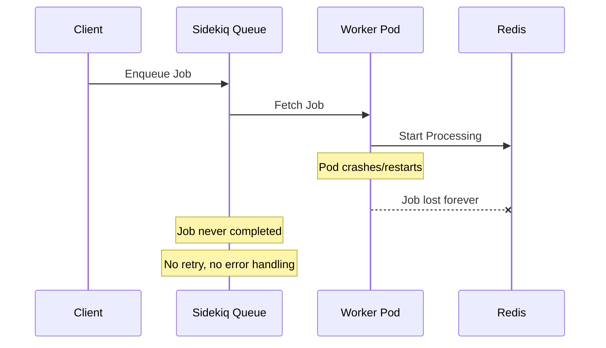
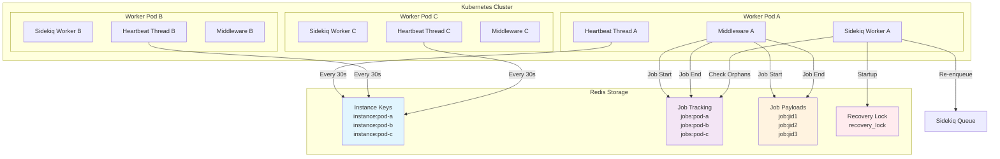

# Sidekiq Processing Tracker

Reliable in-flight job tracking for Sidekiq 6.x on Kubernetes with automatic orphan job recovery.

## Overview

When running Sidekiq workers in Kubernetes, pod restarts and crashes can leave jobs in an inconsistent state. Jobs that were being processed when a pod dies are lost forever, leading to data inconsistency and missed work.

Sidekiq Processing Tracker solves this by:

- **Tracking in-flight jobs** in Redis with per-pod instance identification
- **Heartbeat monitoring** to detect when worker pods go offline
- **Automatic recovery** of orphaned jobs from dead instances
- **Distributed locking** to ensure safe recovery operations
- **Zero configuration** setup with sensible defaults
- **Uses Sidekiq's Redis** - leverages existing Redis connection pool for efficiency

## Problems Solved

### The Lost Job Problem



### Our Solution Architecture



## Installation

Add this line to your application's Gemfile:

```ruby
gem 'sidekiq-processing-tracker'
```

And then execute:

```bash
bundle install
```

## Usage

### Basic Setup

The gem auto-configures itself when required. Simply require it in your application:

```ruby
# In your application (e.g., config/application.rb or config/initializers/sidekiq.rb)
require 'sidekiq-processing-tracker'
```

### Worker Configuration

Include the `ProcessingTracker::Worker` module in workers you want to track:

```ruby
class CriticalDataProcessor
  include Sidekiq::Worker
  include Sidekiq::ProcessingTracker::Worker  # Enables tracking
  
  def perform(user_id, data)
    # This job will be tracked and recovered if the pod crashes
    process_critical_data(user_id, data)
  end
end

class RegularWorker
  include Sidekiq::Worker
  # No ProcessingTracker::Worker - not tracked
  
  def perform
    # This job won't be tracked (use for non-critical work)
  end
end
```

### Manual Configuration

```ruby
Sidekiq::ProcessingTracker.configure do |config|
  config.namespace = "my_app_processing"
  config.heartbeat_interval = 45  # seconds
  config.heartbeat_ttl = 120      # seconds
  config.recovery_lock_ttl = 600  # seconds

  # Optional: Use custom Redis instance (advanced use case)
  # config.redis_options = { url: ENV['TRACKER_REDIS_URL'] }
end

# Note: The gem automatically uses Sidekiq's Redis configuration
# No need to configure Redis separately unless you want isolation
```

## Configuration

All configuration can be done via environment variables:

| Environment Variable | Default | Description |
|---------------------|---------|-------------|
| `PROCESSING_INSTANCE_ID` | Auto-generated | Unique identifier for this worker instance |
| `PROCESSING_NS` | `sidekiq_processing` | Redis namespace for all keys |
| `HEARTBEAT_INTERVAL` | `30` | Seconds between heartbeat updates |
| `HEARTBEAT_TTL` | `90` | Seconds before instance considered dead |
| `RECOVERY_LOCK_TTL` | `300` | Seconds to hold recovery lock |

## Redis Integration

The gem provides flexible Redis integration options:

### Default Configuration (Recommended)
By default, the gem uses Sidekiq's existing Redis connection pool with proper namespacing:

```ruby
# Uses Sidekiq's Redis configuration automatically
Sidekiq::ProcessingTracker.configure do |config|
  config.namespace = "my_app_processing"
end
```

### Custom Redis Configuration (Advanced)
For advanced use cases requiring Redis isolation:

```ruby
Sidekiq::ProcessingTracker.configure do |config|
  config.namespace = "my_app_processing"
  config.redis_options = {
    url: ENV['TRACKER_REDIS_URL'],
    db: 2,
    timeout: 5
  }
end
```

### Benefits
- **Connection Efficiency**: Reuses Sidekiq's connection pool by default
- **Automatic Namespacing**: Uses Redis::Namespace for clean key separation
- **Configuration Consistency**: Inherits Sidekiq's Redis settings
- **Flexible Options**: Support for custom Redis when needed

**Note**: Redis configuration is automatically inherited from Sidekiq's configuration. Configure Redis through Sidekiq's standard methods.

### Kubernetes Deployment Example

```yaml
apiVersion: apps/v1
kind: Deployment
metadata:
  name: sidekiq-workers
spec:
  replicas: 3
  template:
    spec:
      containers:
      - name: worker
        image: myapp:latest
        env:
        - name: PROCESSING_INSTANCE_ID
          valueFrom:
            fieldRef:
              fieldPath: metadata.name  # Use pod name as instance ID
        - name: HEARTBEAT_INTERVAL
          value: "30"
        - name: HEARTBEAT_TTL
          value: "90"
        # Redis configuration is handled by Sidekiq's standard configuration
```

## How It Works

1. **Instance Registration**: Each worker pod generates a unique instance ID and sends periodic heartbeats to Redis
2. **Job Tracking**: When a tracked job starts, the middleware records the job ID and payload in Redis
3. **Job Cleanup**: When a job completes (success or failure), tracking data is removed
4. **Orphan Detection**: On startup, workers check for jobs tracked by dead instances (no recent heartbeat)
5. **Safe Recovery**: Using distributed locking, one worker re-enqueues orphaned jobs back to Sidekiq
6. **Cleanup**: Orphaned tracking data is removed after successful re-enqueuing

## Testing

The gem includes a comprehensive test suite. Run tests with:

```bash
bundle exec rspec
```

### Example Test

```ruby
RSpec.describe "ProcessingTracker Integration" do
  it "recovers orphaned jobs" do
    # Simulate a job from a dead instance
    dead_instance = "dead-pod-123"
    job_data = {
      "class" => "TestWorker",
      "args" => ["important_data"],
      "jid" => "job_123",
      "queue" => "default"
    }
    
    # Set up orphaned job state
    redis.sadd("sidekiq_processing:jobs:#{dead_instance}", job_data["jid"])
    redis.set("sidekiq_processing:job:#{job_data['jid']}", job_data.to_json)
    
    # Run recovery
    expect(Sidekiq::Client).to receive(:push).with(job_data)
    Sidekiq::ProcessingTracker.reenqueue_orphans!
    
    # Verify cleanup
    expect(redis.exists("sidekiq_processing:jobs:#{dead_instance}")).to eq(0)
  end
end
```

## Development

After checking out the repo, run:

```bash
bundle install
bundle exec rspec  # Run tests
bundle exec rubocop  # Check code style
```

## Contributing

Bug reports and pull requests are welcome on GitHub at https://github.com/example/sidekiq-processing-tracker.

## License

The gem is available as open source under the terms of the [MIT License](https://opensource.org/licenses/MIT).
