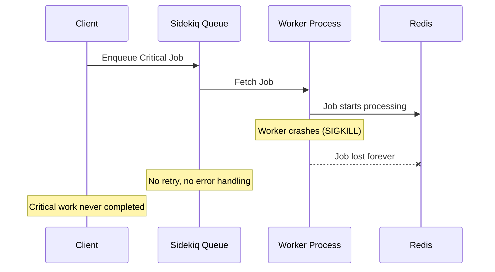
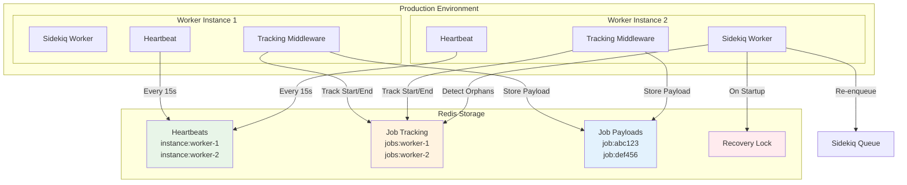

# Sidekiq Assured Jobs

Reliable job execution guarantee for Sidekiq with automatic orphan recovery.

## Overview

Sidekiq Assured Jobs ensures that your critical Sidekiq jobs are never lost due to worker crashes, pod restarts, or unexpected shutdowns. It provides a robust tracking system that monitors in-flight jobs and automatically recovers any work that was interrupted.

**Perfect for:**
- Critical business processes that cannot be lost
- Financial transactions and payment processing
- Data synchronization and ETL operations
- Email delivery and notification systems
- Any job where reliability is paramount

## Key Features

- **🛡️ Job Assurance**: Guarantees that tracked jobs will complete or be automatically retried
- **🔄 Automatic Recovery**: Detects and re-enqueues orphaned jobs from crashed workers
- **⚡ Zero Configuration**: Works out of the box with sensible defaults
- **🏗️ Production Ready**: Designed for high-throughput production environments
- **🔗 Sidekiq Integration**: Uses Sidekiq's existing Redis connection pool
- **🔒 Distributed Locking**: Prevents duplicate recovery operations
- **📊 Minimal Overhead**: Lightweight tracking with configurable heartbeat intervals

## The Problem

When Sidekiq workers crash or are forcefully terminated (SIGKILL), jobs that were being processed are lost forever:



## The Solution

Sidekiq Assured Jobs tracks in-flight jobs and automatically recovers them:



## Installation

Add this line to your application's Gemfile:

```ruby
gem 'sidekiq-assured-jobs'
```

And then execute:

```bash
bundle install
```

## Quick Start

### 1. Basic Setup

The gem auto-configures itself when required:

```ruby
# In your application (e.g., config/application.rb or config/initializers/sidekiq.rb)
require 'sidekiq-assured-jobs'
```

### 2. Enable Job Tracking

Include the `AssuredJobs::Worker` module in workers you want to track:

```ruby
class PaymentProcessor
  include Sidekiq::Worker
  include Sidekiq::AssuredJobs::Worker  # Enables job assurance

  def perform(payment_id, amount)
    # This job will be tracked and recovered if the worker crashes
    process_payment(payment_id, amount)
  end
end

class LogCleanupWorker
  include Sidekiq::Worker
  # No AssuredJobs::Worker - not tracked (fine for non-critical work)

  def perform
    # This job won't be tracked
    cleanup_old_logs
  end
end
```

### 3. That's It!

Your critical jobs are now protected. If a worker crashes while processing a tracked job, another worker will automatically detect and re-enqueue it.

## Configuration

### Environment Variables

All configuration can be done via environment variables:

| Environment Variable | Default | Description |
|---------------------|---------|-------------|
| `ASSURED_JOBS_INSTANCE_ID` | Auto-generated | Unique identifier for this worker instance |
| `ASSURED_JOBS_NS` | `sidekiq_assured_jobs` | Redis namespace for all keys |
| `ASSURED_JOBS_HEARTBEAT_INTERVAL` | `15` | Seconds between heartbeat updates |
| `ASSURED_JOBS_HEARTBEAT_TTL` | `45` | Seconds before instance considered dead |
| `ASSURED_JOBS_RECOVERY_LOCK_TTL` | `300` | Seconds to hold recovery lock |

### Programmatic Configuration

```ruby
Sidekiq::AssuredJobs.configure do |config|
  config.namespace = "my_app_assured_jobs"
  config.heartbeat_interval = 30  # seconds
  config.heartbeat_ttl = 90       # seconds
  config.recovery_lock_ttl = 600  # seconds

  # Optional: Use custom Redis instance (advanced use case)
  # config.redis_options = { url: ENV['ASSURED_JOBS_REDIS_URL'] }
end
```

## Advanced Features

### Redis Integration

The gem provides flexible Redis integration options:

#### Default Configuration (Recommended)
By default, the gem uses Sidekiq's existing Redis connection pool:

```ruby
# Uses Sidekiq's Redis configuration automatically
Sidekiq::AssuredJobs.configure do |config|
  config.namespace = "my_app_assured_jobs"
end
```

#### Custom Redis Configuration (Advanced)
For advanced use cases requiring Redis isolation:

```ruby
Sidekiq::AssuredJobs.configure do |config|
  config.namespace = "my_app_assured_jobs"
  config.redis_options = {
    url: ENV['ASSURED_JOBS_REDIS_URL'],
    db: 2,
    timeout: 5
  }
end
```

### Benefits
- **Connection Efficiency**: Reuses Sidekiq's connection pool by default
- **Custom Namespacing**: Efficient key prefixing without external dependencies
- **Configuration Consistency**: Inherits Sidekiq's Redis settings
- **Flexible Options**: Support for custom Redis when needed

### SidekiqUniqueJobs Integration

The gem automatically integrates with [sidekiq-unique-jobs](https://github.com/mhenrixon/sidekiq-unique-jobs) to ensure orphaned unique jobs can be recovered immediately:

```ruby
class UniquePaymentProcessor
  include Sidekiq::Worker
  include Sidekiq::AssuredJobs::Worker

  sidekiq_options unique: :until_executed

  def perform(payment_id)
    # This job will be tracked and can be recovered even with unique constraints
    process_payment(payment_id)
  end
end
```

**Benefits:**
- **Immediate Recovery**: Orphaned unique jobs are re-enqueued immediately (no waiting period)
- **Automatic Detection**: Works seamlessly whether SidekiqUniqueJobs is present or not
- **Surgical Precision**: Only clears locks for confirmed orphaned jobs
- **Error Resilience**: Continues operation even if lock clearing fails

## Production Deployment

### Kubernetes Example

```yaml
apiVersion: apps/v1
kind: Deployment
metadata:
  name: sidekiq-workers
spec:
  replicas: 3
  template:
    spec:
      containers:
      - name: worker
        image: myapp:latest
        env:
        - name: ASSURED_JOBS_INSTANCE_ID
          valueFrom:
            fieldRef:
              fieldPath: metadata.name  # Use pod name as instance ID
        - name: ASSURED_JOBS_HEARTBEAT_INTERVAL
          value: "15"
        - name: ASSURED_JOBS_HEARTBEAT_TTL
          value: "45"
```

### Docker Compose Example

```yaml
version: '3.8'
services:
  worker:
    image: myapp:latest
    environment:
      - ASSURED_JOBS_INSTANCE_ID=${HOSTNAME}
      - ASSURED_JOBS_HEARTBEAT_INTERVAL=15
      - ASSURED_JOBS_HEARTBEAT_TTL=45
    deploy:
      replicas: 3
```

## How It Works

1. **Instance Registration**: Each worker instance generates a unique ID and sends periodic heartbeats to Redis
2. **Job Tracking**: When a tracked job starts, the middleware records the job ID and payload in Redis
3. **Job Cleanup**: When a job completes (success or failure), tracking data is removed
4. **Orphan Detection**: On startup, workers check for jobs tracked by dead instances (no recent heartbeat)
5. **Safe Recovery**: Using distributed locking, one worker re-enqueues orphaned jobs back to Sidekiq
6. **Cleanup**: Orphaned tracking data is removed after successful re-enqueuing

## Use Cases

### Financial Services
```ruby
class PaymentProcessor
  include Sidekiq::Worker
  include Sidekiq::AssuredJobs::Worker

  def perform(payment_id, amount)
    # Critical: Payment must be processed
    process_payment(payment_id, amount)
  end
end
```

### Data Synchronization
```ruby
class DataSyncWorker
  include Sidekiq::Worker
  include Sidekiq::AssuredJobs::Worker

  def perform(sync_batch_id)
    # Important: Data consistency depends on completion
    sync_data_batch(sync_batch_id)
  end
end
```

### Email Delivery
```ruby
class CriticalEmailWorker
  include Sidekiq::Worker
  include Sidekiq::AssuredJobs::Worker

  def perform(email_id)
    # Must deliver: Password resets, order confirmations, etc.
    deliver_critical_email(email_id)
  end
end
```

## Testing

Run the test suite:

```bash
bundle exec rspec
```

## Dependencies

### Runtime Dependencies
- `sidekiq` (>= 6.0, < 7)
- `redis` (~> 4.0)

### Development Dependencies
- `rspec` (~> 3.0)
- `bundler` (~> 2.0)
- `rubocop` (~> 1.0)

## Contributing

Bug reports and pull requests are welcome on GitHub at https://github.com/example/sidekiq-assured-jobs.

## License

The gem is available as open source under the terms of the [MIT License](https://opensource.org/licenses/MIT).
